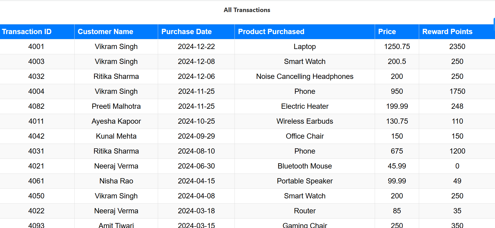
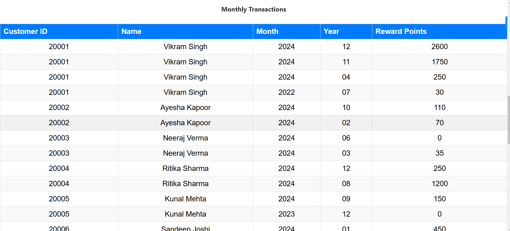
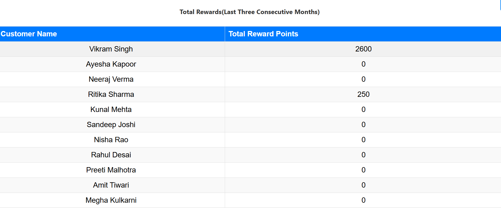
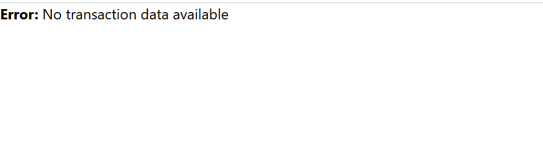
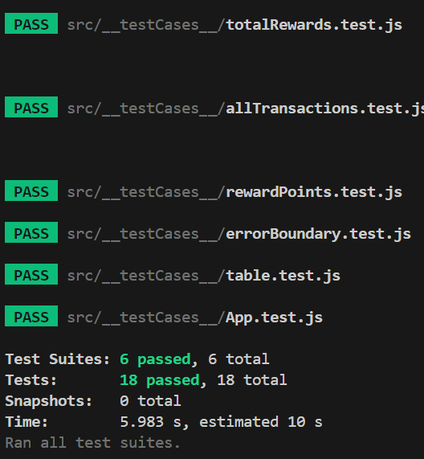
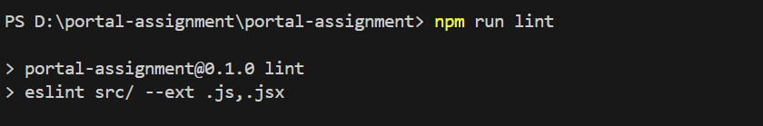

# Rewards App

A web application built using **React.js** that calculates and displays rewards points for transactions. It takes a list of customer transactions, computes reward points based on transaction data,total rewards and monthly rewards  for each customer.

## Table of Contents

- [Technologies Used](#technologies-used)
- [Approach](#approach)

- [Key Components](#key-components)


- [Screenshots](#screenshots)
- [Testing](#testing)

- [Contributing](#contributing)


## Technologies Used
- **React.js** - Frontend framework
- **ESLint** - JavaScript linting
- **Babel** - Transpiling modern JavaScript and JSX
- **PropTypes** - Type-checking for React props
- **JavaScript (ES6+)** - For clean and modern coding

## Approach

1. Used Reduce and map method instead of for loops
2. Fetched the data with error handling
3. Calculated transactions with its reward points
4. Then Calulcated the monthly transactions and sorted them in descending order for each customer
5. Then Calulcated the consecutive last three months total reward points of each customer and kept 0 for customers with no transactions in
last three months


## Key Components
- **`src/index.js`** - Entry point of the React application.
- **`src/App.js`** - Main app structure containing tables for transactions, rewards, and summary.
- **`monthlyTransactions.js`** - Displays user monthly rewards.
- **`allTransactions.js`** - Shows a table of transactions.
- **`totalRewards.js`** - Displays total rewards in last three consective months per customer.
- **`rewardPoints.js`** - Computes reward points based on transactions.
- **`monthlyRewards.js`** - Logic for monthly reward calculations.
- **`totalRewardPoints.js`** - Computes total rewards for the last three months.
-**`sortData.js`** - Sort data in terms of year month and date.

- **`table.js`** - comman table for rendering the reward points and transactions.
- **`heading.js`** - For displaying the headings
 

## Screenshots
- **Main Page - All Transactions**
- **Main Page - Total Monthly Rewards (Customer Wise)**
- **Main Page - Total Rewards for Last Three Consecutive Months**


All Transactions




Monthly Transactions




TotalTransactions(Consecutive last three months)




No Data Available




Loader while fetching data


Error handling when wrong api hit


## Testing
This project includes **unit tests** using **Jest and React Testing Library**.

### Run tests:
```sh
npm run test
```



Eslintric




## Contributing
Pull requests are welcome! Follow these steps:
1. Fork the repository.
2. Create a new branch: `git checkout -b feature-branch`
3. Commit changes: `git commit -m "Add new feature"`
4. Push: `git push origin feature-branch`
5. Open a pull request.

