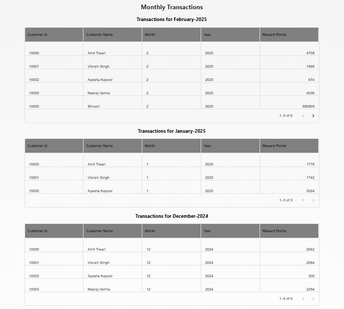

# Rewards App

A web application built using **React.js** that calculates and displays rewards points for transactions. It takes a list of customer transactions, computes reward points based on transaction data,total rewards and monthly rewards  for each customer.

## Table of Contents

- [Technologies Used](#technologies-used)
- [Approach](#approach)

- [Key Components](#key-components)


- [Screenshots](#screenshots)
- [Testing](#testing)

- [Contributing](#contributing)


## Technologies Used
- **React.js** - Frontend framework
- **ESLint** - JavaScript linting
- **Babel** - Transpiling modern JavaScript and JSX
- **PropTypes** - Type-checking for React props
- **JavaScript (ES6+)** - For clean and modern coding
- **jsDoc** - For documenting


## Approach

1. Used Reduce and map method instead of for loops
2. Fetched the data with error handling

3. Calculated transactions with its reward points
4. Calculate the user monthtly total rewards and created seprate table for different months
5. Then Calulcated total rewards in a particular time frame
6. Filtered on the basis of date
7. Sorting the data based on each column


## Key Components
- **`src/index.js`** - Entry point of the React application.
- **`src/App.js`** - Main app structure containing tables for transactions, rewards, and summary.
- **`monthlyTransactions.js`** - Displays user monthly rewards.
- **`allTransactions.js`** - Shows a table of transactions.
- **`totalRewards.js`** - Displays total rewards in last three consective months per customer.
- **`rewardPoints.js`** - Computes reward points based on transactions.
- **`monthlyRewards.js`** - Logic for monthly reward calculations.
- **`totalRewardPoints.js`** - Computes total rewards for the last three months.


- **`table.js`** - comman table for rendering the reward points and transactions.
- **`heading.js`** - For displaying the headings
- **`errBoundary.js`** - For displaying the errors
- **`dateComponent.js`** - For displaying the date and filter the data accordingly
- 
 

## Screenshots
- **Main Page - All Transactions**
- **Main Page - Monthly Total Transactions**
- **Main Page - Total Rewards**


All Transactions


Monthly Total Transactions




TotalTransactions(Consecutive last three months)


Filter By Date


No Data Available


Loader while fetching data


Error handling when wrong api hit


## Testing
This project includes **unit tests** using **Jest and React Testing Library**.

### Run tests:
```sh
npm run test
```


Eslintric


In the project directory, you can run:

npm start
Runs the app in the development mode.
Open http://localhost:3030 to view it in your browser.

The page will reload when you make changes.
You may also see any lint errors in the console.

npm run lint
This will show the elint errors.

npm run build
Builds the app for production to the build folder.
It correctly bundles React in production mode and optimizes the build for the best performance.

The build is minified and the filenames include the hashes.
Your app is ready to be deployed!

See the section about deployment for more information.


## Contributing
Pull requests are welcome! Follow these steps:
1. Fork the repository.
2. Create a new branch: `git checkout -b feature-branch`
3. Commit changes: `git commit -m "Add new feature"`
4. Push: `git push origin feature-branch`
5. Open a pull request.

